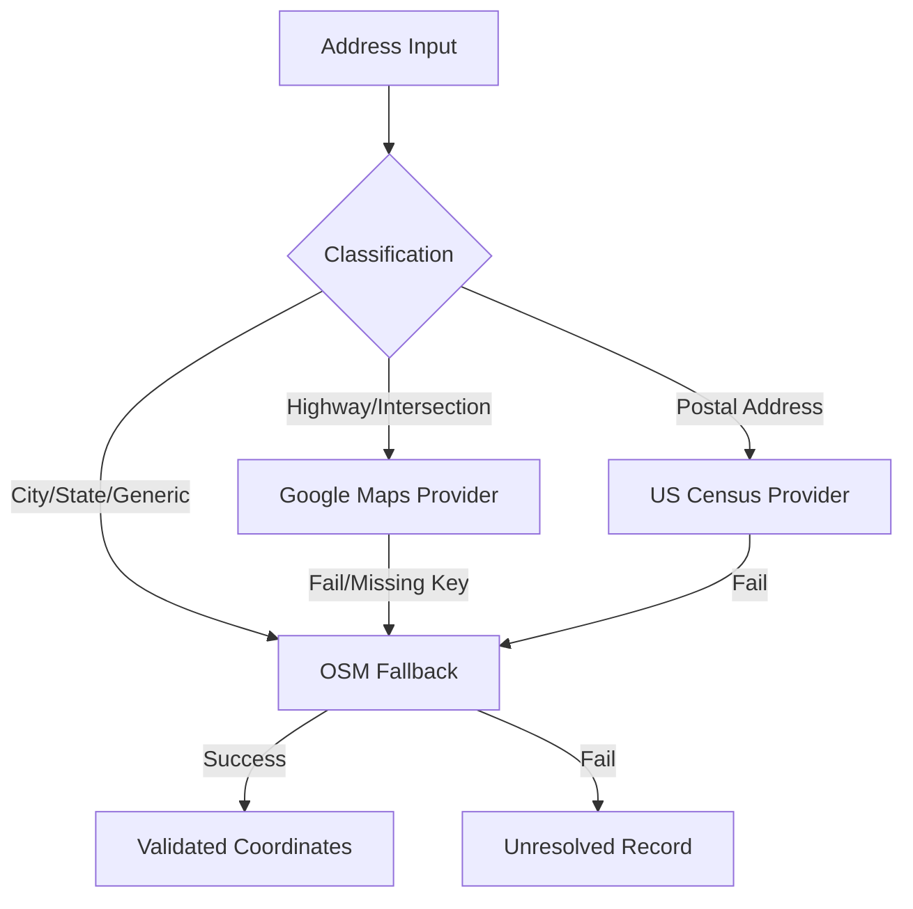

# Technical Architecture Deep Dive

This document explains the "How" and "Why" behind the engineering choices of the Smart Fuel Router.

## 1. The Geocoding Resilience Layer
A major challenge was the variety of address formats in the input data (e.g., "I-95 & US-1" vs "123 Main St"). 

### Decision Strategy
We implemented a **Multi-Tiered Geocoding Router**. Instead of relying on a single expensive provider, the system analyzes the query string and routes it through the most effective and cost-efficient provider.



## 2. Fuel Optimization: Modified Greedy Algorithm
The goal is to complete a route (e.g., 2,000 miles) at minimum cost with a vehicle range of 500 miles.

### Why not Dynamic Programming?
While this is a shortest-path problem variant, the state space (discrete fuel levels) and the high density of stations make a full DP approach computationally expensive for a real-time API.

### Implementation: The Look-Ahead Strategy
Our Modified Greedy Algorithm works as follows:
1.  **Safe Horizon**: From the current location, identify all reachable stations within the 500-mile range.
2.  **Cheaper Search**: Look for any station within that range that is **cheaper** than the current one.
3.  **Variable Purchase**: 
    - If a cheaper station exists: Buy *only* enough fuel to reach that cheaper station.
    - If no cheaper station exists: **Fill up** to maximize the distance traveled at the current "local minimum" price.

### Performance Analysis
- **Time Complexity**: $O(N \log M)$ where $N$ is route length and $M$ is station density.
- **Reliability**: Guarantees a valid path if one exists, unlike simple heuristic models.

## 3. Spatial Data Infrastructure
We chose **PostGIS** over standard relational databases for its native support for GIST indexing. This allows us to perform "Corridor Searches" (finding stations within $X$ miles of a 2,000-mile line) in milliseconds.

```sql
-- Conceptual query used in the backend
SELECT name, price, geom 
FROM fuel_stations 
WHERE ST_DWithin(geom, ST_GeomFromText('LINESTRING(...)'), corridor_radius_meters)
ORDER BY price ASC;
```

## 4. Engineering Trade-offs & Security
- **Auth Strategy**: We chose Header-based API Key auth for its simplicity and ease of integration for mobile/external systems.
- **Scalability**: The system is fully containerized, allowing for HORIZONTAL scaling of the OSRM routing engine independently of the Django API.
